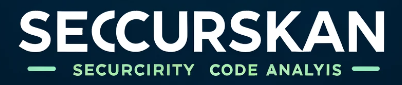

  

Securiskan is a cutting-edge code analysis tool currently in development, aimed at uncovering security vulnerabilities across various file types. Utilizing a powerful suite of libraries along with sophisticated static analysis algorithms, Securiskan is designed to enhance the security of web applications through the early detection of potential security vulnerabilities. This project is actively being refined to provide comprehensive security insights and solutions for developers and organizations.

## Features

- **Comprehensive Analysis**: Support for multiple programming languages, including PHP, JavaScript, HTML, and TypeScript.
- **Vulnerability Detection**: Identification of a wide range of vulnerabilities, such as XSS, SQL Injection, and other known security flaws.
- **Detailed Reports**: Generation of reports highlighting specific vulnerabilities, their exact locations in the code, and suggestions for mitigation.
- **Ease of Use**: A simple and intuitive user interface for file uploads and analysis visualization.
- **Continuous Integration**: Capability to integrate with CI/CD pipelines for automated code analysis.

## How to Use

To use Securiskan, follow these simple steps:

1. **File Upload**: Visit the Securiskan site and use the upload field to submit the code file you wish to analyze.
2. **Analysis**: The system will automatically process the file and perform the vulnerability analysis.
3. **Report Viewing**: Upon analysis completion, a detailed report will be available, indicating the found vulnerabilities and offering recommendations for correction.

## Contribution

Contributions to the project are welcome! If you have a suggestion to improve Securiskan, feel free to create a pull request or open an issue.

## License

Securiskan is distributed under the MIT License. See LICENSE for more information.

Developed with ❤️
